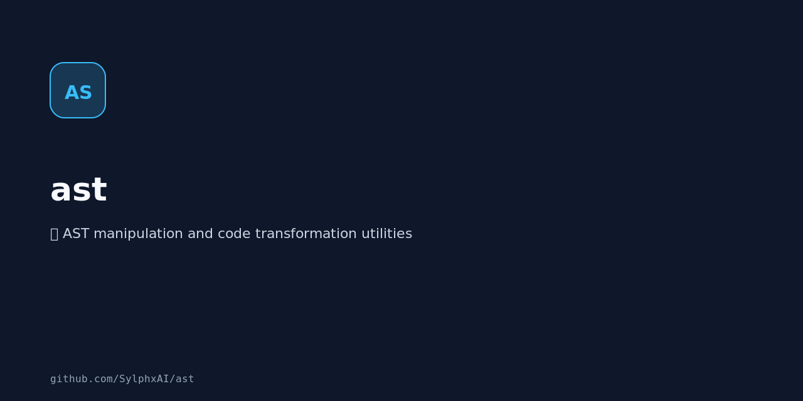

<div align="center">

# AST - Abstract Syntax Tree Tools 🌳

<p align="center">
  
</p>


**Type-safe AST parsing for JavaScript with extensible architecture**

[](https://github.com/SylphxAI/ast/blob/main/LICENSE)
[](https://bun.sh)
[](https://www.typescriptlang.org/)
[](https://biomejs.dev/)

**ANTLR-powered** • **Type-safe** • **Extensible** • **Monorepo**

[Architecture](#-architecture) • [Packages](#-packages) • [Development](#-development)

</div>

---

## 🚀 Overview

A production-grade Abstract Syntax Tree (AST) parsing toolkit built with TypeScript and ANTLR v4. Currently supports **JavaScript** parsing with an architecture designed for multi-language extensibility.

**The Problem:**
```
Traditional AST tools:
- Tightly coupled to single languages ❌
- Difficult to extend or customize ❌
- Limited type safety ❌
- Complex integration ❌
```

**The Solution:**
```
AST Toolkit:
- Clean, extensible architecture ✅
- ANTLR-powered parsing ✅
- Full TypeScript type safety ✅
- Monorepo structure for modularity ✅
```

**Result: Production-ready AST parsing with a foundation for supporting any programming language.**

---

## MCP Family Role

AST is a foundation package for the SylphxAI MCP family, not an MCP server. It
owns the `@sylphlab/ast-*` package line: ANTLR-backed parser contracts, typed
node interfaces, source spans, grammar fixtures, and JavaScript-first package
behavior.

Rust-native MCP products such as Architecture Reader MCP and CodeRAG may use
AST outputs only through public package exports, generated fixtures, or stable
contract files. They must not import workspace internals or add a TypeScript MCP
adapter here.

See the family roadmap:
[`docs/roadmap/mcp-family-ast-foundation.md`](./docs/roadmap/mcp-family-ast-foundation.md).

---

## ⚡ Key Features

### Parser Architecture

| Feature | Description | Benefit |
|---------|-------------|---------|
| **ANTLR v4** | Industry-standard parser generator | Proven, battle-tested |
| **Type-safe** | Full TypeScript with strict mode | Catch errors at compile-time |
| **Extensible** | Core + language modules | Easy to add new languages |
| **Visitor Pattern** | ANTLR parse tree → Custom AST | Clean transformation |

### Development Experience

- **Monorepo structure** - Organized with Bun workspaces + Turborepo
- **Modern tooling** - Bun, Biome, Turborepo, and commitlint
- **Testing** - Vitest for fast, reliable tests
- **Build** - `tsup` for lightning-fast builds with type declarations
- **Versioning** - Changesets for version management

---

## 📦 Packages

### Core Package

**`@sylphlab/ast-core`**
- Generic AST node interfaces and types
- Foundation for all language parsers
- Zero dependencies
- Fully typed

### Language Parsers

**`@sylphlab/ast-javascript`**
- JavaScript/ECMAScript parser
- ANTLR-generated lexer and parser
- Custom visitor for AST transformation
- Depends on: `@sylphlab/ast-core`, `antlr4ts`

### Architecture

```
┌─────────────────────────────────────────┐
│  @sylphlab/ast-javascript               │
│  (JavaScript-specific parser)           │
└────────────────┬────────────────────────┘
                 │ depends on
                 ▼
┌─────────────────────────────────────────┐
│  @sylphlab/ast-core                     │
│  (Generic AST interfaces & types)       │
└─────────────────────────────────────────┘
```

---

## 🛠️ Technology Stack

| Component | Technology | Purpose |
|-----------|-----------|---------|
| **Language** | TypeScript 5.8 | Type safety & modern JS |
| **Parser** | ANTLR v4 | Grammar-based parsing |
| **Monorepo** | Bun workspaces | Dependency management |
| **Build** | Turborepo | Task orchestration |
| **Bundler** | tsup | Fast ESM/CJS builds |
| **Testing** | Vitest | Unit testing |
| **Linting** | Biome | Code quality |
| **Formatting** | Biome | Code style |
| **Git Hooks** | commitlint | Commit message checks |
| **Versioning** | Changesets | Version management |

---

## 🚀 Quick Start

### Installation

```bash
# Clone repository
git clone https://github.com/SylphxAI/ast.git
cd ast

# Install dependencies
bun install

# Build all packages
bun run build

# Run tests
bun run test
```

### Using the Parser

```typescript
import { parse } from '@sylphlab/ast-javascript';

const code = `
  const greeting = "Hello, World!";
  console.log(greeting);
`;

const ast = parse(code);
console.log(ast);
```

---

## 🏗️ Architecture

### Design Principles

1. **Separation of Concerns**
   - Core types separated from language implementations
   - Each language parser in its own package

2. **Extensibility**
   - Easy to add new language parsers
   - Shared core interfaces for consistency

3. **Type Safety**
   - Strict TypeScript throughout
   - Full type inference

4. **ANTLR Integration**
   - Grammar files (`.g4`) define language syntax
   - Generated lexer/parser from grammar
   - Custom visitor transforms parse tree to AST

### Parsing Flow

```
Source Code (String)
       │
       ▼
  ANTLR Lexer
  (Tokenization)
       │
       ▼
  ANTLR Parser
  (Parse Tree)
       │
       ▼
  Custom Visitor
  (Transformation)
       │
       ▼
  Custom AST
  (@sylphlab/ast-core types)
```

---

## 💻 Development

### Workspace Structure

```
ast/
├── packages/
│   ├── core/              # @sylphlab/ast-core
│   │   ├── src/
│   │   ├── package.json
│   │   └── tsconfig.json
│   └── javascript/        # @sylphlab/ast-javascript
│       ├── src/
│       ├── grammar/       # .g4 grammar files
│       ├── package.json
│       └── tsconfig.json
├── package.json           # Root workspace config
├── turbo.json             # Turborepo configuration
└── README.md
```

### Common Commands

```bash
# Development
bun run test:watch            # Watch mode for tests

# Building
bun run build                 # Build all packages
turbo run build            # Build with Turborepo

# Testing
bun run test                  # Run all tests
bun run test:watch            # Watch mode for tests

# Code Quality
bun run lint                  # Lint all packages
bun run lint:fix              # Auto-fix linting issues
bun run format                # Format code with Biome
bun run check-format          # Check formatting
bun run typecheck             # TypeScript type checking

# Full Validation
bun run validate              # Format/lint, generated parser freshness, typecheck, test, build

# ANTLR (JavaScript package)
cd packages/javascript
bun run antlr                 # Regenerate committed parser files after grammar changes
```

### Adding a New Language Parser

1. **Create package directory**
   ```bash
   mkdir packages/new-language
   cd packages/new-language
   ```

2. **Create package.json**
   ```json
   {
     "name": "@sylphlab/ast-new-language",
     "version": "0.0.0",
     "dependencies": {
       "@sylphlab/ast-core": "workspace:*",
       "antlr4ts": "^0.5.0-alpha.4"
     }
   }
   ```

3. **Add grammar file**
   - Find or create ANTLR `.g4` grammar for the language
   - Place in `grammar/` directory

4. **Implement visitor**
   - Create custom visitor to transform ANTLR parse tree
   - Map to `@sylphlab/ast-core` types

5. **Export parser**
   ```typescript
   export function parse(code: string): AstNode {
     // Implementation
   }
   ```

---

## 🎯 Current Status

### ✅ Completed

- [x] Monorepo structure with Bun + Turborepo
- [x] Core AST type definitions (`@sylphlab/ast-core`)
- [x] JavaScript parser package (`@sylphlab/ast-javascript`)
- [x] ANTLR v4 integration
- [x] ECMAScript grammar integration
- [x] Basic visitor structure
- [x] Build system configuration
- [x] Testing infrastructure
- [x] Code quality tooling (Biome, commitlint)

### 🚧 In Progress

- [ ] Complete AST visitor implementation
- [ ] Comprehensive test coverage
- [ ] Position tracking improvements
- [ ] Grammar validation and refinement

### 🔮 Planned

- [ ] Support for additional JavaScript features
- [ ] TypeScript parser
- [ ] Python parser
- [ ] Go parser
- [ ] AST manipulation utilities
- [ ] Pretty printer (AST → source code)
- [ ] Documentation site

---

## 🧪 Testing

### Running Tests

```bash
# Run all tests
bun run test

# Watch mode
bun run test:watch

# Test specific package
cd packages/javascript
bun run test
```

### Test Structure

```typescript
import { describe, it, expect } from 'vitest';
import { parse } from '@sylphlab/ast-javascript';

describe('JavaScript Parser', () => {
  it('should parse variable declarations', () => {
    const code = 'const x = 42;';
    const ast = parse(code);
    expect(ast).toBeDefined();
  });
});
```

---

## 🔧 Configuration

### TypeScript

Strict mode enabled with:
- `noImplicitAny: true`
- `strictNullChecks: true`
- `strictFunctionTypes: true`

### Biome

Biome owns formatting and linting. The root `biome.json` is the source of truth for code style and lint behavior.

### ANTLR

Grammar generation:
```bash
antlr4ts -visitor -listener -o src/generated grammar/*.g4
```

---

## 📚 Resources

### ANTLR Documentation
- [ANTLR Official Site](https://www.antlr.org/)
- [antlr4ts Documentation](https://github.com/tunnelvisionlabs/antlr4ts)
- [ANTLR Grammar Repository](https://github.com/antlr/grammars-v4)

### AST Resources
- [ESTree Specification](https://github.com/estree/estree) (JavaScript AST spec)
- [TypeScript Compiler API](https://github.com/microsoft/TypeScript/wiki/Using-the-Compiler-API)

---

## 🤝 Contributing

Contributions are welcome! Please follow these guidelines:

1. **Open an issue** - Discuss changes before implementing
2. **Fork the repository**
3. **Create a feature branch** - `git checkout -b feature/my-feature`
4. **Follow code standards** - Run `bun run validate`
5. **Write tests** - Maintain high coverage
6. **Commit with conventional commits** - `feat:`, `fix:`, `docs:`, etc.
7. **Submit a pull request**

### Commit Message Format

```
feat(javascript): add support for async/await
fix(core): correct position tracking for nested nodes
docs(readme): update installation instructions
```

---

## Project Control and Release Proof

This repository dogfoods [GroundAtlas](https://github.com/SylphxAI/groundatlas)
through CI. The vendor-neutral project facts live in `project.manifest.json`;
Sylphx-specific governance facts stay in `.doctrine/project.json`; generated
`.groundatlas*` files plus GroundAtlas JSON/Markdown reports are evidence/navigation only, not source of truth.

Package releases run through the shared Sylphx release workflow and are complete
only after CI, the Release workflow, and npm registry readback for changed AST
packages. Parser behavior changes additionally require package tests and
consumer smoke evidence for affected parser contracts.

## 📄 License

MIT © [Sylphx](https://sylphx.com)

---

## 🙏 Credits

Built with:
- [ANTLR](https://www.antlr.org/) - Parser generator
- [antlr4ts](https://github.com/tunnelvisionlabs/antlr4ts) - ANTLR runtime for TypeScript
- [TypeScript](https://www.typescriptlang.org/) - Language
- [Bun](https://bun.sh/) - Package manager and test/runtime tooling
- [Turborepo](https://turbo.build/) - Monorepo tool
- [Vitest](https://vitest.dev/) - Testing framework

---

<p align="center">
  <strong>Type-safe AST parsing for the modern web</strong>
  <br>
  <sub>Built with TypeScript and ANTLR</sub>
  <br><br>
  <a href="https://sylphx.com">sylphx.com</a> •
  <a href="https://x.com/SylphxAI">@SylphxAI</a> •
  <a href="mailto:hi@sylphx.com">hi@sylphx.com</a>
</p>
